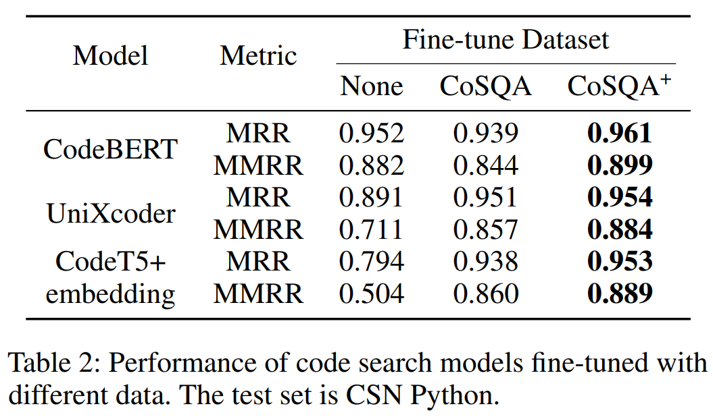

# CoSQA-plus

This repository contains code and datasets for the paper "CoSQA+: Enhancing Code Search Dataset with Matching Code"

Our primary work can be divided into three parts: constructing CoSQA+([CoSQA+ Construction](#cosqa-construction)), testing large models for question answering, and testing code search models and methods([Test on CoSQA+](#test-on-cosqa)). This code repository will provide the corresponding code for these three sections as well as the data required to reproduce the results.

The construction of CoSQA+ can be broken down into three steps. The first step is data collection and processing. The second involves matching queries with code to form 100K pairs, and using Claude 3 Sonnet to judge whether the code matches the query. The third step is generating code for queries that were not successfully matched with code.

Testing code search models and methods requires downloading and configuring various code search models and methods to perform code search tests, calculating MRR and MMRR.

Testing large models for question answering primarily focuses on evaluating the performance of various large models in question answering, calculating their Krippendorff’s alpha compared to human annotators and their accuracy relative to standards.

**Performance of CoSQA+**:

<center>
  
</center>


**If you just want to use CoSQA+ dataset itself, go to [Train on CoSQA+](#train-on-cosqa) and [Test on CoSQA+](#test-on-cosqa) directly.**

## Model Size & Budget

In our experiment, we used large models: CodeBERT, UniXcoder, and CodeT5+ 110M embedding.

Their parameter sizes are **125M**, **125M**, and **110M** respectively. These are relatively small among large models, but they still require GPU acceleration for less time consumption.

In the experiments, it is not necessary to pre-train the large models - only fine-tuning and inference are needed. The batch size can be adjusted based on the available GPU memory or system memory.

Additionally, it's worth noting that the dataset construction process involves large-scale matrix operations (for computing similarity). To avoid excessive memory usage, we also optimized the batch processing during dataset construction - the batch size can be adjusted based on the available memory. The model test program does not have this batch optimization for matrix operations, so running the tests will consume **around 14GB of memory**.

## Our Experiment Environment

Hardware:

- Intel(R) Xeon(R) Platinum 8360H CPU @ 3.00GHz
- 4 * NVIDIA GeForce RTX 4090
- 500GB RAM

Software:

- Ubuntu 22.04.1 LTS
- Python3.10.6

Requirements:

```
numpy==1.26.4
transformers==4.39.1
tqdm==4.66.2
scikit-learn==1.4.2
pandas==2.2.1
ollama==0.1.7
openai==1.30.5
matplotlib==3.8.4
joblib==1.4.0
krippendorff==0.6.1
```

## Dataset and Code Overview

### Datasets

The datasets are currently available for viewing at the following Google Drive link:

https://drive.google.com/drive/folders/1yoIoNfVI4vN5dk3VLuvGGorOE4fOleDT?usp=sharing

| Filename                                       | Content                                                           |
| ---------------------------------------------- | ----------------------------------------------------------------- |
| StaQC-code.json                                | python codebase from StaQC                                       |
| CSN-StaQC-code.json                            | python codebase from StaQC and CSN                                |
| gpt4o_augment_codebase.json                    | CoSQA+ codebase (GPT-4o generated code + code from StaQC and CSN) |
| query.json                                     | query of CoSQA/CoSQA+                                             |
| dataset_annotation_claude3sonnet_processed.csv | the query-code pairs annotation result of Claude 3 Sonnet       |
| gpt4o_augment_query_code_pairs.json            | all query-code pairs of CoSQA+                                    |
| gpt4o_augment_query_code_pairs_for_search.json | query-code pairs labelled "1"" of CoSQA+                         |

CoSQA+ codebase: `gpt4o_augment_codebase.json`

format example:

```json
{
    "code-idx": 0,
    "code": "def clean_empty(d):\n    if not isinstance(d, (dict, list)):\n        return d\n    if isinstance(d, list):\n        return [v for v in (clean_empty(v) for v in d) if v]\n    return {k: v for k, v in ((k, clean_empty(v)) for k, v in d.items()) if v}"
}
```

CoSQA+/CoSQA query base: `query.json`

format example:

```json
{
	"query-idx": 0, 
	"query": "python remove all empty items in list"
}
```

CoSQA+ query-code pairs: `gpt4o_augment_query_code_pairs.json`

format example:

```json
{
    "pair-idx": 0,
    "query-idx": 0,
    "query": "python remove all empty items in list",
    "code-idx": 0,
    "code": "def clean_empty(d):\n    if not isinstance(d, (dict, list)):\n        return d\n    if isinstance(d, list):\n        return [v for v in (clean_empty(v) for v in d) if v]\n    return {k: v for k, v in ((k, clean_empty(v)) for k, v in d.items()) if v}",
    "label": 1
}
```

CoSQA+ query-code pairs (filtered for label 1): `gpt4o_augment_query_code_pairs_for_search.json`

### Code

The `datasetBuild` folder stores the code for building the CoSQA+ dataset and testing large model question answering.

Code for tool functions to build the CoSQA+ dataset: `process_data.py`

Program for matching queries to code: `select_code.py`

Program for calculating Krippendorff’s alpha: `krippendorff_calculate.py`

The `evaluateMMRR` folder stores the code for testing code search models and methods on the CoSQA+ benchmark.

Test program for pylucene: `run_MMRR_pylucene.py`

Test program for bow: `bow_MMRR.py`

Test program for transformer large models (CodeBERT, UniXcoder, CodeT5+ etc.): `run_MMRR_transformer.py`

The `prompt` folder stores prompt texts.

## Prepare

Before experiment, clone CoSQA+ repo.

enter a project floder and clone repo

```
mkdir csproject
cd csproject
git clone
```

**NOTE**: the CoSQA+ repo floder should be named `CoSQA-plus` and it’s **NOT** the root dir / workspace dir of this project!

The project floder structure may look like:

```
csproject/
	CoSQA-plus/
		dataset/
		datasetBuild/
		evaluateMMRR/
		prompt/
	model/
	saved_models/
	embedding/
```

## CoSQA+ Construction

Note that **fully reproducing this part requires significant resources**, especially since annotating with large models incurs high costs. Therefore, we mainly provide guidelines for reproducing query-to-code matching using a multi-model approach.

### Download Code Datasets

**The quickest way** is to download our curated datasets (Google Drive):

Filtered and merged StaQC Python code `StaQC-code.json`:

https://drive.google.com/file/d/1rgA4ptcUBioHbK9T49T2GYQ8A5Jde2nb/view?usp=sharing

Filtered StaQC Python code and CodeSearchNet Python code merged dataset `CSN-StaQC-code.json`:

https://drive.google.com/file/d/15n8H3WzfjC0MejXvwU2o7seRI0tjQ1wk/view?usp=drive_link

If you want to reconstruct the codebase, you can follow the instructions below:

We need `python_dedupe_definitions_v2.pkl` from CodeSearchNet's python.zip and two pkl files from StaQC: `python_how_to_do_it_by_classifier_multiple_iid_to_code.pickle` and `python_how_to_do_it_qid_by_classifier_unlabeled_single_code_answer_qid_to_code.pickle`.

After downloading, please place them in the `dataset` folder of the project.

The code datasets from [CodeSearchNet](https://github.com/github/CodeSearchNet/tree/master?tab=readme-ov-file) and [StaQC](https://github.com/LittleYUYU/StackOverflow-Question-Code-Dataset) can be downloaded according to their official instructions.

Alternatively, you can download them via Hugging Face:

[code-search-net/code_search_net at main (huggingface.co)](https://huggingface.co/datasets/code-search-net/code_search_net/tree/main/data)

[koutch/staqc · Datasets at Hugging Face](https://huggingface.co/datasets/koutch/staqc)

For StaQC, preliminary filtering is needed:

```python
python datasetBuild/StaQC_data_to_json.py 
```

Note that the parameter for the function `check_pickle_file("python_how_to_do_it_by_classifier_multiple_iid_to_code.pickle")` should be changed to the directory where you stored the StaQC Python code pkl files. Then, merge the two JSON files.

Finally, merge the CSN Python code with the StaQC Python code. This can be done by calling `process_CSN()` and `merge_CSN_and_StaQC()` in `datasetBuild/process_data.py`.

### Download Query Dataset

[CoCLR/data/qa/cosqa-all.json at main · Jun-jie-Huang/CoCLR (github.com)](https://github.com/Jun-jie-Huang/CoCLR/blob/main/data/qa/cosqa-all.json)

Place the downloaded `cosqa-all.json` in the `dataset` folder from original CoSQA.

Call `process_query()` in `datasetBuild/process_data.py` to complete the processing and obtain `query.json`.

### Match Code for Queries

The main task of matching code to queries is done by `datasetBuild/select_code.py`.

For the amount of code is so large, the task is divided into 2 steps:

1) embed query & code with three models
2) select code by calculating similarity

#### 1 Embed Query&Code

Use the follow cmd to get embedding of query and code:

```
python CoSQA-plus/select_code.py --model_name_or_path codet5p-110m-embedding --task get_embedding \
--query_file CoSQA-plus/dataset/query.json --code_file CoSQA-plus/dataset/CSN-StaQC-code.json \
--code_length 360 --nl_length 64 --eval_batch_size 640 --seed 123456

python CoSQA-plus/select_code.py --model_name_or_path unixcoder-base --task get_embedding \
--query_file CoSQA-plus/dataset/query.json --code_file CoSQA-plus/dataset/CSN-StaQC-code.json \
--code_length 256 --nl_length 128 --eval_batch_size 640 --seed 123456

python CoSQA-plus/select_code.py --model_name_or_path codebert-base --task get_embedding \
--query_file CoSQA-plus/dataset/query.json --code_file CoSQA-plus/dataset/CSN-StaQC-code.json \
--code_length 256 --nl_length 128 --eval_batch_size 640 --seed 123456
```

Then, you will get 6 `.pkl` file, which are the results of embedding query&code :

codet5p-110m-embedding_CSN_StaQC_code_vecs.pkl
codet5p-110m-embedding_nl_vecs.pkl
codebert-base_CSN_StaQC_code_vecs.pkl
codebert-base_nl_vecs.pkl
unixcoder-base_CSN_StaQC_code_vecs.pkl
unixcoder-base_nl_vecs.pkl

Make a dir named `embedding` and move the 6 files into it:

```
mkdir embedding
mv codet5p-110m-embedding_CSN_StaQC_code_vecs.pkl \
codet5p-110m-embedding_nl_vecs.pkl \
codebert-base_CSN_StaQC_code_vecs.pkl \
codebert-base_nl_vecs.pkl \
unixcoder-base_CSN_StaQC_code_vecs.pkl \
unixcoder-base_nl_vecs.pkl \
embedding/
```

#### 2 Select Code by Calculating Similarity

Use the follow cmd to select code by calculating similarity：

```
python CoSQA-plus/select_code.py --model_name_or_path unixcoder-base codet5p-110m-embedding codebert-base --task select_code \
--query_file CoSQA-plus/dataset/query.json --code_file CoSQA-plus/dataset/CSN-StaQC-code.json \
--code_length 256 --nl_length 128 --eval_batch_size 640 --seed 123456
```

This code will read the 6 files in `embedding`(mentioned [above](#1-embed-querycode)) and calculate the similarity between query vectors and code vectors. Notbly, the memory usage of this step is extremely high. The similarity matrix will be computed in batches and **you may need to adjust the variable `batch_size` in `def select_code(args)` function to fit you computer**. The `batch_size` should be a factor of num of queries (that is 20604).

When it comes to success of this step,  there will be 2 files, `selected_code.json` and `selected_code.pickle` , which contain 5 selected code for each query.

`selected_code.json` looks like:

```json
[
    {
        "query": "python remove all empty items in list",
        "top1_code": "def clean_empty(d):\n    if not isinstance(d, (dict, list)):\n        return d\n    if isinstance(d, list):\n        return [v for v in (clean_empty(v) for v in d) if v]\n    return {k: v for k, v in ((k, clean_empty(v)) for k, v in d.items()) if v}",
        "top2_code": "def clear_list_value(self, value):\n        \"\"\"\n        Clean the argument value to eliminate None or Falsy values if needed.\n        \"\"\"\n        # Don't go any further: this value is empty.\n        if not value:\n            return self.empty_value\n        # Clean empty items if wanted\n        if self.clean_empty:\n            value = [v for v in value if v]\n        return value or self.empty_value",
        "top3_code": ">>> list = []\n>>> if list:\n        #You would use find here.\n...     print(\"not empty\")\n... else:\n...     print(\"empty\")\n... \nempty\n>>>",
        "top4_code": "def remove_from_list(list, remove_items):\n    list = return_list(list)\n    remove_items = return_list(remove_items)\n    for remove in remove_items:\n        if remove in list:\n            list.remove(remove)\n\n    return list",
        "top5_code": "def remove_empty_list(self):\n        for attr in dir(self.base_settings):\n            value = getattr(self.base_settings, attr)\n            if (type(value) is list) and len(value) == 0:\n                delattr(self.base_settings, attr)",
        "top_code_index": "[1260037, 1039066, 1163538, 940139, 858888]"
    },
    ...
]
```

### Annotation and Code Generation

Before leveraging LLM for annotaion, the transform of `selected_code.json` is needed. Use the `from_top5_to_individual` function of `process_data.py` to make query-code pairs.

The results are to be saved in `query_code_pairs.json` and the content looks like:

```json
[
    {
        "pair-idx": 0,
        "query-idx": 0,
        "query": "python remove all empty items in list",
        "code-idx": 0,
        "code": "def clean_empty(d):\n    if not isinstance(d, (dict, list)):\n        return d\n    if isinstance(d, list):\n        return [v for v in (clean_empty(v) for v in d) if v]\n    return {k: v for k, v in ((k, clean_empty(v)) for k, v in d.items()) if v}\n"
    },
    {
        "pair-idx": 1,
        "query-idx": 0,
        "query": "python remove all empty items in list",
        "code-idx": 1,
        "code": "def clear_list_value(self, value):\n        \"\"\"\n        Clean the argument value to eliminate None or Falsy values if needed.\n        \"\"\"\n        # Don't go any further: this value is empty.\n        if not value:\n            return self.empty_value\n        # Clean empty items if wanted\n        if self.clean_empty:\n            value = [v for v in value if v]\n        return value or self.empty_value"
    },
    ...
]
```

Then, use `dataset_label.py`(relies on `askLLM.py`) for annotaton. You need to modify the code to run it well :

1. For `askLLM.py` , modify the path to read your `apikey.txt` or you can just directly wirte you api key in code. Furthermore, you need to setup the model and other setting options.
2. For `dataset_label.py`
   1. modify `input_file` and `output_file` to set the path of input file (`query_code_pairs.json`) and output_file (such as `dataset_annotation_claude3sonnet.json`).
   2. modify `max_concurrent_tasks` to adjust the num of threads for request LLM api.
   3. modify the file path in `def get_prompt(query,code)` function to set the prompt.

After that, we get answers from LLM (`f `) which need to be extracted the final judgement. Use `def judgement_extraction(input_file, processed_file)` function to do that :

```python
judgement_extraction("dataset_annotation_claude3sonnet.json","final_query_code_pairs.json")
```

In fact, this is just the ideal situation because the LLM may generate wrong answers which deviate the prompt. So you may wash the data by hand and try to generate missing answers of specific pairs for several times.  The following functions in `process_data.py` may help:`def remove_no_answer_row(input_file, processed_file)`,`def remove_empty_row(input_file, processed_file)`,`def drop_n_pair_index(input_file,processed_file,pair_index)`,`def change_to_no(input_file,processed_file,pair_index)`

Finally, we will get annotation results in `final_query_code_pairs.json`，which looks like：

```python
    {
        "pair-idx": 0,
        "query-idx": 0,
        "query": "python remove all empty items in list",
        "code-idx": 0,
        "code": "def clean_empty(d):\n    if not isinstance(d, (dict, list)):\n        return d\n    if isinstance(d, list):\n        return [v for v in (clean_empty(v) for v in d) if v]\n    return {k: v for k, v in ((k, clean_empty(v)) for k, v in d.items()) if v}\n",
        "label": "yes"
    },
    ...
]
```

Finish primary annotation, the next step is find out queries without matched code.

## Test LLMs for Annotation

Use `dataset_labe.py` (mentioned in [Annotation and Code Generation](#annotation-and-code-generation)) to leverage LLMs for annotation.

After merging all the result of annotation randomly selected 1000 query-code pairs, we will get `human_query_code_pairs_1000_merge_all`.

The file `human_query_code_pairs_1000_merge_all` we offer also includes human annotation results.

Then use `krippendorff_calculate.py` to calculate the krippendorff.

```
python CoSQA-plus/datasetBuild/krippendorff_calculate.py
```

## Train on CoSQA+

We provide a general framework program to train(fine-tune) and test transformer model (build with transformers lib) : `run_MMRR_transformer.py`

### Fine-tune

Make the dir to save fine-tuned model `.bin`

```
mkdir -p ./saved_models/cosqa
mkdir ./model
mkdir ./
```

Download datasets:

1. CoSQA dataset : [CoCLR/data/search at main · Jun-jie-Huang/CoCLR (github.com)](https://github.com/Jun-jie-Huang/CoCLR/tree/main/data/search)
2. CoSQA+ for fine-tune : https://drive.google.com/drive/folders/1hP8253ao1G95ddWwgeyrezxGXULnlHEe?usp=sharing
3. CSN99 Python : https://drive.google.com/drive/folders/16u9Ob7Jskqzs0oNzmoN-q-CHVaMuHShA?usp=sharing

Download models:

1. CodeBERT (provided by [GraphCodeBERT](https://github.com/microsoft/CodeBERT/tree/master/GraphCodeBERT) team)  https://drive.google.com/file/d/1ZO-xVIzGcNE6Gz9DEg2z5mIbBv4Ft1cK/view
2. UniXcoder  [microsoft/unixcoder-base · Hugging Face](https://huggingface.co/microsoft/unixcoder-base)
3. CodeT5+ 110M embedding  [Salesforce/codet5p-110m-embedding · Hugging Face](https://huggingface.co/Salesforce/codet5p-110m-embedding)

#### Fine-tune on CoSQA

Use `run_fine_tune.py` to fine-tune on CoSQA.

##### CodeBERT

```
CUDA_VISIBLE_DEVICES="0,1,2,3" CoSQA-plus/evaluateMMRR/run_fine_tune.py \
    --output_dir saved_models/cosqa/codebert \
    --model_name_or_path model/codebert-base  \
    --do_train \
    --train_data_file CoSQA-plus/dataset/CoSQA/cosqa-retrieval-train-19604.json \
    --eval_data_file CoSQA-plus/dataset/CoSQA/cosqa-retrieval-dev-500.json \
    --codebase_file CoSQA-plus/dataset/CoSQA/code_idx_map.txt \
    --num_train_epochs 10 \
    --code_length 256 \
    --nl_length 128 \
    --train_batch_size 64 \
    --eval_batch_size 64 \
    --learning_rate 2e-5 \
    --seed 123456
```

##### UniXcoder

```
CUDA_VISIBLE_DEVICES="0,1,2,3" CoSQA-plus/evaluateMMRR/run_fine_tune.py \
    --output_dir saved_models/cosqa/unixcoder \
    --model_name_or_path model/unixcoder-base  \
    --do_train \
    --train_data_file CoSQA-plus/dataset/CoSQA/cosqa-retrieval-train-19604.json \
    --eval_data_file CoSQA-plus/dataset/CoSQA/cosqa-retrieval-dev-500.json \
    --codebase_file CoSQA-plus/dataset/CoSQA/code_idx_map.txt \
    --num_train_epochs 10 \
    --code_length 256 \
    --nl_length 128 \
    --train_batch_size 64 \
    --eval_batch_size 64 \
    --learning_rate 2e-5 \
    --seed 123456
```

##### CodeT5+ 110M embedding

Note that `--code_length ` and `--nl_length` are different from CodeBERT and UniXcoder.

```
CUDA_VISIBLE_DEVICES="0,1,2,3" CoSQA-plus/evaluateMMRR/run_fine_tune.py \
    --output_dir saved_models/cosqa/codet5p-110m-embedding \
    --model_name_or_path model/codet5p-110m-embedding  \
    --do_train \
    --train_data_file CoSQA-plus/dataset/CoSQA/cosqa-retrieval-train-19604.json \
    --eval_data_file CoSQA-plus/dataset/CoSQA/cosqa-retrieval-dev-500.json \
    --codebase_file CoSQA-plus/dataset/CoSQA/code_idx_map.txt \
    --num_train_epochs 10 \
    --code_length 360 \
    --nl_length 64 \
    --train_batch_size 64 \
    --eval_batch_size 64 \
    --learning_rate 2e-5 \
    --seed 123456
```

#### Fine-tune on CoSQA+

Simple introduction of command:

`--output_dir` : the dir of fine-tuned model

`--model_name_or_path` : the dir of original model file

`--query_pre_process` : the file of query of test/dev dataset (before preprocess)

`--query_file` : the file of query of test/dev dataset (after preprocess)

`--codebase_file_pre_process` : the file of codebase (before preprocess)

`--codebase_file` : the file of codebase (after preprocess)

`--true_pairs_file`  : the file of query-code pairs labelled 1

`--train_data_file` : the file of query-code pairs used for training

`--code_length` : the length of code token as input for model

`--nl_length` : the length of query token as input for model

`--train_batch_size` : batch size for training

`--eval_batch_size` : batch size for eval/test

`2>&1| tee xxx.log` :  save the log of terminal to xxx.log

NOTE:The preprocess is for the uni-format of data.

##### CodeBERT

```shell
CUDA_VISIBLE_DEVICES="0,1,2,3" python CoSQA-plus/evaluateMMRR/run_MMRR_transformer.py \
    --do_train \
    --output_dir saved_models/cosqa_plus/codebert \
    --model_name_or_path model/codebert-base  \
    --query_pre_process CoSQA-plus/dataset/finetune/dev_query.json \
    --query_file CoSQA-plus/dataset/finetune/dev_query_processed.json \
    --codebase_file_pre_process CoSQA-plus/dataset/gpt4o_augment_codebase.json  \
    --codebase_file CoSQA-plus/dataset/gpt4o_augment_codebase_processed.json \
    --true_pairs_file CoSQA-plus/dataset/gpt4o_augment_query_code_pairs_for_search.json \
    --train_data_file CoSQA-plus/dataset/finetune/train_query_code_pairs.json \
    --num_train_epochs 10 \
    --code_length 256 \
    --nl_length 128 \
    --train_batch_size 64 \
    --eval_batch_size 64 \
    --learning_rate 2e-5 \
    --seed 123456 2>&1| tee CoSQA-plus/log/codebert-base-cosqaplus-finetune.log
```

##### UniXcoder

```shell
CUDA_VISIBLE_DEVICES="0,1,2,3" python CoSQA-plus/evaluateMMRR/run_MMRR_transformer.py \
    --do_train \
    --output_dir saved_models/cosqa_plus/unixcoder \
    --model_name_or_path model/unixcoder-base  \
    --query_pre_process CoSQA-plus/dataset/finetune/dev_query.json \
    --query_file CoSQA-plus/dataset/finetune/dev_query_processed.json \
    --codebase_file_pre_process CoSQA-plus/dataset/gpt4o_augment_codebase.json  \
    --codebase_file CoSQA-plus/dataset/gpt4o_augment_codebase_processed.json \
    --true_pairs_file CoSQA-plus/dataset/gpt4o_augment_query_code_pairs_for_search.json \
    --train_data_file CoSQA-plus/dataset/finetune/train_query_code_pairs.json \
    --num_train_epochs 10 \
    --code_length 256 \
    --nl_length 128 \
    --train_batch_size 64 \
    --eval_batch_size 64 \
    --learning_rate 2e-5 \
    --seed 123456 2>&1| tee CoSQA-plus/log/unixcoder-cosqaplus-finetune.log
```

##### CodeT5+ 110M embedding

Note that `--code_length ` and `--nl_length` are different from CodeBERT and UniXcoder.

```Shell
CUDA_VISIBLE_DEVICES="0,1,2,3" python CoSQA-plus/evaluateMMRR/run_MMRR_transformer.py \
    --do_train \
    --output_dir saved_models/cosqa_plus/codet5p-110m-embedding \
    --model_name_or_path model/codet5p-110m-embedding  \
    --query_pre_process CoSQA-plus/dataset/finetune/dev_query.json \
    --query_file CoSQA-plus/dataset/finetune/dev_query_processed.json \
    --codebase_file_pre_process CoSQA-plus/dataset/gpt4o_augment_codebase.json  \
    --codebase_file CoSQA-plus/dataset/gpt4o_augment_codebase_processed.json \
    --true_pairs_file CoSQA-plus/dataset/gpt4o_augment_query_code_pairs_for_search.json \
    --train_data_file CoSQA-plus/dataset/finetune/train_query_code_pairs.json \
    --num_train_epochs 10 \
    --code_length 360 \
    --nl_length 64 \
    --train_batch_size 64 \
    --eval_batch_size 64 \
    --learning_rate 2e-5 \
    --seed 123456 2>&1| tee CoSQA-plus/log/codet5p-110m-embedding-cosqaplus-finetune.log
```

### Test on CSN99

#### CodeBERT

no fine-tuned

```
CUDA_VISIBLE_DEVICES="0,1,2,3" python CoSQA-plus/evaluateMMRR/run_MMRR_transformer.py \
    --do_test \
    --do_zero_shot \
    --output_dir saved_models/cosqa/codebert \
    --model_name_or_path model/codebert-base  \
    --query_pre_process CoSQA-plus/dataset/CSN99/csn_99_query_data.json \
    --query_file CoSQA-plus/dataset/CSN99/csn_99_query_data_processed.json \
    --codebase_file_pre_process CoSQA-plus/dataset/CSN99/csn_99_code_data.json  \
    --codebase_file CoSQA-plus/dataset/CSN99/csn_99_code_data_processed.json \
    --true_pairs_file CoSQA-plus/dataset/CSN99/csn_99_query_code_pairs.json \
    --num_train_epochs 10 \
    --code_length 256 \
    --nl_length 128 \
    --train_batch_size 64 \
    --eval_batch_size 64 \
    --learning_rate 2e-5 \
    --seed 123456
```

CoSQA

```
CUDA_VISIBLE_DEVICES="0,1,2,3" python CoSQA-plus/evaluateMMRR/run_MMRR_transformer.py \
    --do_test \
    --output_dir saved_models/cosqa/codebert \
    --model_name_or_path model/codebert-base  \
    --query_pre_process CoSQA-plus/dataset/CSN99/csn_99_query_data.json \
    --query_file CoSQA-plus/dataset/CSN99/csn_99_query_data_processed.json \
    --codebase_file_pre_process CoSQA-plus/dataset/CSN99/csn_99_code_data.json  \
    --codebase_file CoSQA-plus/dataset/CSN99/csn_99_code_data_processed.json \
    --true_pairs_file CoSQA-plus/dataset/CSN99/csn_99_query_code_pairs.json \
    --num_train_epochs 10 \
    --code_length 256 \
    --nl_length 128 \
    --train_batch_size 64 \
    --eval_batch_size 64 \
    --learning_rate 2e-5 \
    --seed 123456
```

CoSQA+

```
CUDA_VISIBLE_DEVICES="0,1,2,3" python CoSQA-plus/evaluateMMRR/run_MMRR_transformer.py \
    --do_test \
    --output_dir saved_models/cosqa_plus/codebert \
    --model_name_or_path model/codebert-base  \
    --query_pre_process CoSQA-plus/dataset/CSN99/csn_99_query_data.json \
    --query_file CoSQA-plus/dataset/CSN99/csn_99_query_data_processed.json \
    --codebase_file_pre_process CoSQA-plus/dataset/CSN99/csn_99_code_data.json  \
    --codebase_file CoSQA-plus/dataset/CSN99/csn_99_code_data_processed.json \
    --true_pairs_file CoSQA-plus/dataset/CSN99/csn_99_query_code_pairs.json \
    --num_train_epochs 10 \
    --code_length 256 \
    --nl_length 128 \
    --train_batch_size 64 \
    --eval_batch_size 64 \
    --learning_rate 2e-5 \
    --seed 123456
```

#### UniXcoder

no fine-tuned

```
CUDA_VISIBLE_DEVICES="0,1,2,3" python CoSQA-plus/evaluateMMRR/run_MMRR_transformer.py \
    --do_zero_shot \
    --do_test \
    --output_dir saved_models/cosqa/unixcoder/ \
    --model_name_or_path model/unixcoder-base  \
    --query_pre_process CoSQA-plus/dataset/CSN99/csn_99_query_data.json \
    --query_file CoSQA-plus/dataset/CSN99/csn_99_query_data_processed.json \
    --codebase_file_pre_process CoSQA-plus/dataset/CSN99/csn_99_code_data.json  \
    --codebase_file CoSQA-plus/dataset/CSN99/csn_99_code_data_processed.json \
    --true_pairs_file CoSQA-plus/dataset/CSN99/csn_99_query_code_pairs.json \
    --num_train_epochs 10 \
    --code_length 256 \
    --nl_length 128 \
    --train_batch_size 64 \
    --eval_batch_size 64 \
    --learning_rate 2e-5 \
    --seed 123456 2>&1| tee CoSQA-plus/log/UniXcoder-finetune-csn99-test.log
```

CoSQA

```Shell
CUDA_VISIBLE_DEVICES="0,1,2,3" python CoSQA-plus/evaluateMMRR/run_MMRR_transformer.py \
    --do_test \
    --output_dir saved_models/cosqa/unixcoder/ \
    --model_name_or_path model/unixcoder-base  \
    --query_pre_process CoSQA-plus/dataset/CSN99/csn_99_query_data.json \
    --query_file CoSQA-plus/dataset/CSN99/csn_99_query_data_processed.json \
    --codebase_file_pre_process CoSQA-plus/dataset/CSN99/csn_99_code_data.json  \
    --codebase_file CoSQA-plus/dataset/CSN99/csn_99_code_data_processed.json \
    --true_pairs_file CoSQA-plus/dataset/CSN99/csn_99_query_code_pairs.json \
    --num_train_epochs 10 \
    --code_length 256 \
    --nl_length 128 \
    --train_batch_size 64 \
    --eval_batch_size 64 \
    --learning_rate 2e-5 \
    --seed 123456 2>&1| tee CoSQA-plus/log/UniXcoder-cosqa-finetune-csn99-test.log
```

CoSQA+

```
CUDA_VISIBLE_DEVICES="0,1,2,3" python CoSQA-plus/evaluateMMRR/run_MMRR_transformer.py \
    --do_test \
    --output_dir saved_models/cosqa_plus/unixcoder/ \
    --model_name_or_path model/unixcoder-base  \
    --query_pre_process CoSQA-plus/dataset/CSN99/csn_99_query_data.json \
    --query_file CoSQA-plus/dataset/CSN99/csn_99_query_data_processed.json \
    --codebase_file_pre_process CoSQA-plus/dataset/CSN99/csn_99_code_data.json  \
    --codebase_file CoSQA-plus/dataset/CSN99/csn_99_code_data_processed.json \
    --true_pairs_file CoSQA-plus/dataset/CSN99/csn_99_query_code_pairs.json \
    --num_train_epochs 10 \
    --code_length 256 \
    --nl_length 128 \
    --train_batch_size 64 \
    --eval_batch_size 64 \
    --learning_rate 2e-5 \
    --seed 123456 2>&1| tee CoSQA-plus/log/UniXcoder-cosqaplus-finetune-csn99-test.log
```

#### CodeT5+ 110M embedding

no fine-tuned

```
CUDA_VISIBLE_DEVICES="0,1,2,3" python CoSQA-plus/evaluateMMRR/run_MMRR_transformer.py \
    --do_zero_shot \
    --do_test \
    --output_dir saved_models/cosqa/codet5p-110m-embedding/ \
    --model_name_or_path model/codet5p-110m-embedding  \
    --query_pre_process CoSQA-plus/dataset/CSN99/csn_99_query_data.json \
    --query_file CoSQA-plus/dataset/CSN99/csn_99_query_data_processed.json \
    --codebase_file_pre_process CoSQA-plus/dataset/CSN99/csn_99_code_data.json  \
    --codebase_file CoSQA-plus/dataset/CSN99/csn_99_code_data_processed.json \
    --true_pairs_file CoSQA-plus/dataset/CSN99/csn_99_query_code_pairs.json \
    --num_train_epochs 10 \
    --code_length 360 \
    --nl_length 64 \
    --train_batch_size 64 \
    --eval_batch_size 64 \
    --learning_rate 2e-5 \
    --seed 123456 2>&1| tee CoSQA-plus/log/codet5p-110m-embedding-finetune-csn99-test.log
```

CoSQA

```
CUDA_VISIBLE_DEVICES="1,2,3" python CoSQA-plus/evaluateMMRR/run_MMRR_transformer.py \
    --do_test \
    --output_dir saved_models/cosqa/codet5p-110m-embedding/ \
    --model_name_or_path model/codet5p-110m-embedding  \
    --query_pre_process CoSQA-plus/dataset/CSN99/csn_99_query_data.json \
    --query_file CoSQA-plus/dataset/CSN99/csn_99_query_data_processed.json \
    --codebase_file_pre_process CoSQA-plus/dataset/CSN99/csn_99_code_data.json  \
    --codebase_file CoSQA-plus/dataset/CSN99/csn_99_code_data_processed.json \
    --true_pairs_file CoSQA-plus/dataset/CSN99/csn_99_query_code_pairs.json \
    --num_train_epochs 10 \
    --code_length 360 \
    --nl_length 64 \
    --train_batch_size 64 \
    --eval_batch_size 64 \
    --learning_rate 2e-5 \
    --seed 123456 2>&1| tee CoSQA-plus/log/codet5p-110m-embedding-cosqa-finetune-csn99-test.log
```

CoSQA+

```
CUDA_VISIBLE_DEVICES="1,2,3" python CoSQA-plus/evaluateMMRR/run_MMRR_transformer.py \
    --do_test \
    --output_dir saved_models/cosqa_plus/codet5p-110m-embedding-1/ \
    --model_name_or_path model/codet5p-110m-embedding  \
    --query_pre_process CoSQA-plus/dataset/CSN99/csn_99_query_data.json \
    --query_file CoSQA-plus/dataset/CSN99/csn_99_query_data_processed.json \
    --codebase_file_pre_process CoSQA-plus/dataset/CSN99/csn_99_code_data.json  \
    --codebase_file CoSQA-plus/dataset/CSN99/csn_99_code_data_processed.json \
    --true_pairs_file CoSQA-plus/dataset/CSN99/csn_99_query_code_pairs.json \
    --num_train_epochs 10 \
    --code_length 360 \
    --nl_length 64 \
    --train_batch_size 64 \
    --eval_batch_size 64 \
    --learning_rate 2e-5 \
    --seed 123456 2>&1| tee CoSQA-plus/log/codet5p-110m-embedding-cosqaplus-finetune-csn99-test.log
```

## Test on CoSQA+

### Transformer Model

The command for testing models on CoSQA+ is almost the same as [Test on CSN99](#test-on-csn99) , just change the query,codebase and pairs files.

```
CUDA_VISIBLE_DEVICES="0,1,2,3" /mnt/thinkerhui/.venv/bin/python CoSQA-plus/evaluateMMRR/run_MMRR_transformer.py \
 --output_dir /mnt/thinkerhui/saved_models/cosqa/codebert \
    --model_name_or_path model/codebert-base  \
    --do_zero_shot \
    --do_test \
    --query_pre_process CoSQA-plus/dataset/finetune/test_query.json \
    --query_file CoSQA-plus/dataset/finetune/test_query_process.json \
    --codebase_file_pre_process CoSQA-plus/dataset/gpt4o_augment_codebase.json \
    --codebase_file CoSQA-plus/dataset/gpt4o_augment_codebase_process.json \
    --true_pairs_file CoSQA-plus/dataset/gpt4o_augment_query_code_pairs_for_search.json \
    --num_train_epochs 10 \
    --code_length 256 \
    --nl_length 128 \
    --train_batch_size 64 \
    --eval_batch_size 64 \
    --learning_rate 2e-5 \
    --seed 123456  2>&1| tee CoSQA-plus/log/codebert-finetune-mmrr2.log

CUDA_VISIBLE_DEVICES="0,1,2,3" /mnt/thinkerhui/.venv/bin/python CoSQA-plus/evaluateMMRR/run_MMRR_transformer.py \
--output_dir /mnt/thinkerhui/saved_models/cosqa/unixcoder \
    --model_name_or_path model/unixcoder-base  \
    --do_zero_shot \
    --do_test \
    --query_pre_process CoSQA-plus/dataset/finetune/test_query.json \
    --query_file CoSQA-plus/dataset/finetune/test_query_process.json \
    --codebase_file_pre_process CoSQA-plus/dataset/gpt4o_augment_codebase.json \
    --codebase_file CoSQA-plus/dataset/gpt4o_augment_codebase_process.json \
    --true_pairs_file CoSQA-plus/dataset/gpt4o_augment_query_code_pairs_for_search.json \
    --num_train_epochs 10 \
    --code_length 256 \
    --nl_length 128 \
    --train_batch_size 64 \
    --eval_batch_size 64 \
    --learning_rate 2e-5 \
    --seed 123456  2>&1| tee CoSQA-plus/log/unixcoder-finetune-mmrr2.log
  
CUDA_VISIBLE_DEVICES="0,1,2,3" python CoSQA-plus/evaluateMMRR/run_MMRR_transformer.py \
    --output_dir /mnt/thinkerhui/saved_models/cosqa/codet5p-110m-embedding \
    --model_name_or_path model/codet5p-110m-embedding  \
    --do_zero_shot \
    --do_test \
    --query_pre_process CoSQA-plus/dataset/finetune/test_query.json \
    --query_file CoSQA-plus/dataset/finetune/test_query_process.json \
    --codebase_file_pre_process CoSQA-plus/dataset/gpt4o_augment_codebase.json \
    --codebase_file CoSQA-plus/dataset/gpt4o_augment_codebase_process.json \
    --true_pairs_file CoSQA-plus/dataset/gpt4o_augment_query_code_pairs_for_search.json \
    --num_train_epochs 2 \
    --code_length 360 \
    --nl_length 64 \
    --train_batch_size 64 \
    --eval_batch_size 64 \
    --learning_rate 2e-5 \
    --seed 123456  2>&1| tee CoSQA-plus/log/final_codet5p-110m-embedding-mmrr1.log
```

### Other method/model

Besides, we offer programs for pylucene and BoW to test on CoSQA+ : `run_MMRR_pylucene.py` , `bow_MMRR.py`.

Additional requirements of pylib to run `bow_MMRR.py`:

```
sci-kit
scipy
```

```
python CoSQA-plus/evaluateMMRR/bow_MMRR.py
```

And run `run_MMRR_pylucene.py` is a little more complex.

Download the source code for Pylucene [here]([Index of /lucene/pylucene (apache.org)](https://dlcdn.apache.org/lucene/pylucene/)). Download Pylucene-9.6.0-src.Tar.Gz. The source package contains all the packages you need to build manually. Extract the source package into the directory you want.

Install Temurin Java (Adoptium) :

```
sudo -s
apt install wget apt-transport-https gnupg
wget -O - https://packages.adoptium.net/artifactory/api/gpg/key/public | apt-key add -
echo "deb https://packages.adoptium.net/artifactory/deb $(awk -F= '/^VERSION_CODENAME/{print$2}' /etc/os-release) main" | tee /etc/apt/sources.list.d/adoptium.list
apt update
apt install temurin-17-jdk
```

Install gcc, g++ and make:

```
sudo apt install gcc g++ make
```

Build Pylecene go back to the Directory ~/pylecene-9.6.0 and edit the Makefile. As you can see in the first half of the file, there are many different system configurations that have been commented out. We need to find our own system configuration, uncomment it, and then change the configuration to the correct one based on the actual situation. The actual job is to validate the Python path. Here, we find the configuration code for Linux + Python 3, uncomment it and confirm as follows.

```
# Linux     (Ubuntu 64-bit, Python 3.9.2, Temurin Java 17
PREFIX_PYTHON=/usr
PYTHON=$(PREFIX_PYTHON)/bin/python3
JCC=$(PYTHON) -m jcc --shared
NUM_FILES=16
```

Then, make:

```
make
sudo make test
sudo make install
```

Finally, run `run_MMRR_pylucene.py` :

```
python CoSQA-plus/evaluateMMRR/run_MMRR_pylucene.py
```

## Statistics

`statistics.py` is used for statistics of CoSQA+

## **Recruitment and Payment**

We have recruited volunteer annotators with strong Python expertise to perform the data annotation tasks. The compensation rate is set at 50 CNY per hour. As of June 17, 2024, a total of 3,600 CNY has been spent on this effort.

In addition, about 3,000 CNY has been spent on the model API of Anthropic and OpenAI.

Moving forward, we plan to continue expanding the annotation work based on the evolving project requirements.
